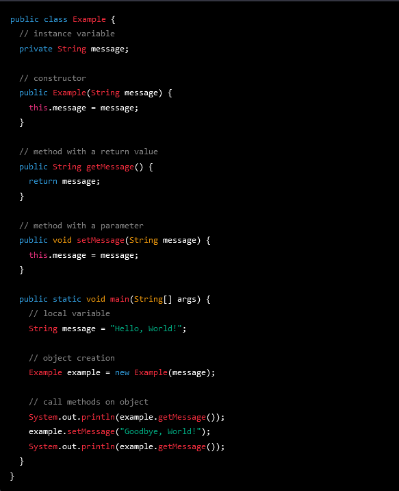

KnowledgeBook

The KnowledgeBook is a collection of programm that are included inside a Wiki system.

JTree for the organisation for all files/ methods.

Goal of KnowledgeBook
 - Listing all Methods which I got to know
 - Opportunity to get examples from old projects I made, if I have to do something similar
 - Showing all knowledge and skills about Java

Please notice that this project is not jet finished and not all the files are implemented inside the project. 

Idees:
- Blueprints -> fo each Folder a Blueprint section with base code methods

API
 - Network driver monitoring
 - autodetect
 
 
 
 Beispiel eines Java Quellcodes:
 

**message** ist eine Instanzvariable, die in der Klasse **Example** gespeichert wird.
Der Konstruktor **Example(String message)** wird aufgerufen, wenn ein neues **Example**-Objekt erstellt wird. Es initialisiert die Instanzvariable message.
Die Methoden **getMessage()** und **setMessage(String message)** bieten Zugriff auf die Instanzvariable **message**. Die erste Methode gibt einen Wert zurück, die zweite Methode nimmt einen Wert entgegen.
In der **main**-Methode wird eine lokale Variable message erstellt und ein **Example**-Objekt mit diesem Wert als Argument erstellt.
Schließlich werden die Methoden **getMessage** und **setMessage** aufgerufen, um den Inhalt der Instanzvariable **message** auszugeben und zu ändern.

